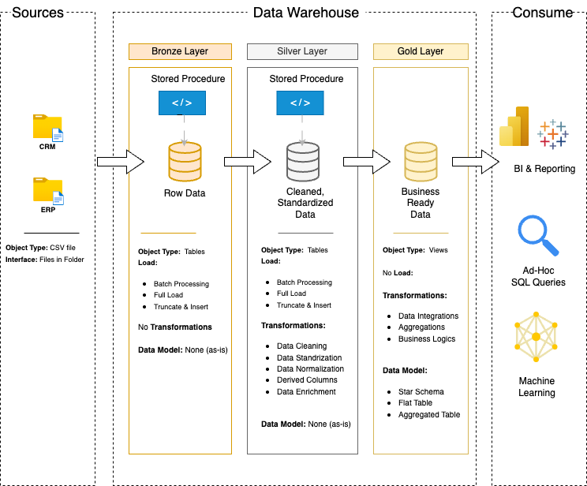

# 🏛️ Data Warehouse and Analytics Project  

📊 **Ласкаво просимо до репозиторію "Data Warehouse and Analytics Project"!**  
Цей проєкт демонструє **повний цикл побудови сховища даних** – від збору та обробки інформації до отримання бізнес-інсайтів.  

🌟 Ідеальний кейс для портфоліо, що відображає **кращі практики Data Engineering та Data Analytics**.  

---

## 🏗️ Архітектура даних  

Проєкт базується на **Medallion Architecture** з трьома рівнями:  

🔸 **Bronze (Сирі дані):** збереження необроблених CSV-файлів із систем ERP та CRM у SQL Server.  
🔸 **Silver (Очищені дані):** нормалізація, стандартизація та підготовка даних для аналітики.  
🔸 **Gold (Аналітичні дані):** створення **зіркової схеми (star schema)** для ефективного аналізу.  
    <td align="center"> </td>

---

## 📌 Основні завдання  

✅ **Створення сховища даних** на основі PostgreSQL .  
✅ **ETL-процеси:** завантаження, трансформація та очищення даних.  
✅ **Моделювання даних:** побудова фактів і вимірювань для оптимальних SQL-запитів.  
✅ **Аналітика та звітність:** розробка SQL-звітів та інтерактивних дашбордів.  

---

## 🛠️ Використані технології  

✔ **PostgreSQL** – основна база даних  
✔ **DBeaver** –  графічний інструмент для управління БД
✔ **DrawIO** – візуалізація архітектури даних  
✔ **GitHub** – контроль версій  
✔ **Notion** – планування та документація  

---

## 🚀 Вимоги до проєкту  

### 🎯 Побудова сховища даних  
- Імпорт даних із ERP та CRM (CSV) у SQL Server  
- Очищення та нормалізація даних  
- Об'єднання джерел у єдину аналітичну модель  

### 🎯 Аналітика та звітність  
- Аналіз поведінки клієнтів  
- Визначення топ-продуктів  
- Дослідження трендів продажів  

---

## 📂 Структура репозиторію  
📁 **datasets/**  → Початкові CSV-дані (ERP, CRM)  
📁 **docs/**  → Схеми бази, моделювання, документація  
📁 **scripts/**  → SQL-скрипти для ETL-процесів  
📁 **tests/**  → Перевірка якості даних  
📄 **README.md**  → Огляд проєкту  
📄 **requirements.txt**  → Залежності  

---

## 🛡️ Ліцензія  

Цей проєкт ліцензовано за **MIT License**. Ви можете використовувати, змінювати та поширювати його з вказанням авторства.  

---

## 🙌 Подяка  

Цей проєкт створений за мотивами уроку від **[Data with Baraa](https://www.youtube.com/watch?v=9GVqKuTVANE&t=3909s&ab_channel=DatawithBaraa)**.  
Дякую за чудовий навчальний матеріал! 🙏  

----------------------------------------------------------

# 🏛️ Data Warehouse and Analytics Project  

📊 **Welcome to the "Data Warehouse and Analytics Project" repository!**  
This project demonstrates the **full data warehousing lifecycle** – from data collection and processing to business insights.  

🌟 A perfect portfolio project showcasing **best practices in Data Engineering and Data Analytics**.  

---

## 🏗️ Data Architecture  

The project follows the **Medallion Architecture**, structured into three layers:  

🔸 **Bronze (Raw Data):** Storing unprocessed CSV files from ERP and CRM systems in SQL Server.  
🔸 **Silver (Cleansed Data):** Standardizing and normalizing data for analytics.  
🔸 **Gold (Business-Ready Data):** Creating a **star schema** for optimized analytical queries.  
<td align="center"> </td>
---

## 📌 Key Project Tasks  

✅ **Building a modern data warehouse** using SQL Server.  
✅ **ETL Pipelines:** Extracting, transforming, and cleansing data.  
✅ **Data Modeling:** Designing fact and dimension tables for efficient queries.  
✅ **Analytics & Reporting:** Generating SQL-based reports and dashboards.  

---

## 🛠️ Technologies Used  

✔ **PostgreSQL** – Primary database system
✔ **DBeaver** – Graphical tool for database management
✔ **DrawIO** – Data architecture visualization  
✔ **GitHub** – Version control  
✔ **Notion** – Project planning and documentation  

---

## 🚀 Project Requirements  

### 🎯 Building the Data Warehouse  
- Import ERP and CRM data (CSV) into PostgreSQL  
- Clean and normalize the data  
- Integrate sources into a single analytical model  

### 🎯 Analytics & Reporting  
- Customer behavior analysis  
- Top-performing products  
- Sales trend insights  

---

## 📂 Repository Structure  
📁 **datasets/**  → Raw ERP and CRM data (CSV files)  
📁 **docs/**  → Schema, modeling, and documentation  
📁 **scripts/**  → SQL scripts for ETL and transformations  
📁 **tests/**  → Data quality tests  
📄 **README.md**  → Project overview  
📄 **requirements.txt**  → Dependencies  

## 🛡️ License  

This project is licensed under the **MIT License**. You are free to use, modify, and share this project with proper attribution.  

---

## 🙌 Acknowledgment  

This project is inspired by the lesson from **[Data with Baraa](https://www.youtube.com/watch?v=9GVqKuTVANE&t=3909s&ab_channel=DatawithBaraa)**.  
Many thanks for the great educational content! 🙏  

